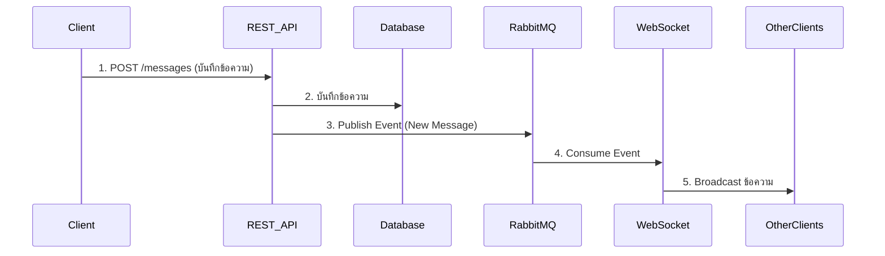

## Back-End Architecture Overview

ในส่วนของ **Back-End** ระบบถูกออกแบบภายใต้แนวคิด **Monolith Modular Architecture**  
โดยมีการแยก `service` ต่างๆ ออกเป็น `module` อย่างชัดเจน  
เพื่อรองรับการขยายระบบไปสู่ **Microservices Architecture** ได้อย่างง่ายในอนาคต

ระบบได้นำ **Message Broker** อย่าง **RabbitMQ** มาใช้สำหรับการสื่อสารระหว่าง `services`  
โดยใช้ทั้งรูปแบบ:

- **RPC (Remote Procedure Call)**
- **Pub/Sub (Publish/Subscribe)**

เพื่อใช้ในการจัดการ **Message Queue**

### จุดประสงค์หลัก

- เพื่อใช้ส่งข้อความระหว่าง `services`
- สามารถกระจายข้อมูล (broadcast) ไปยัง `clients` หลายรายได้อย่างมีประสิทธิภาพ

